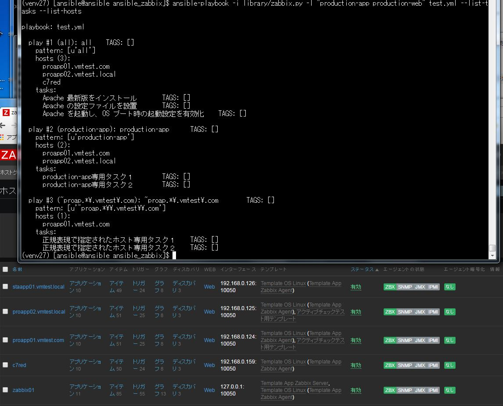
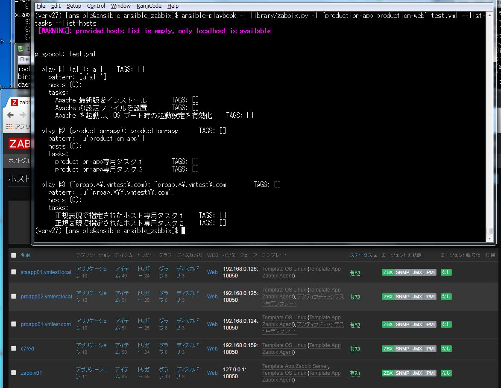
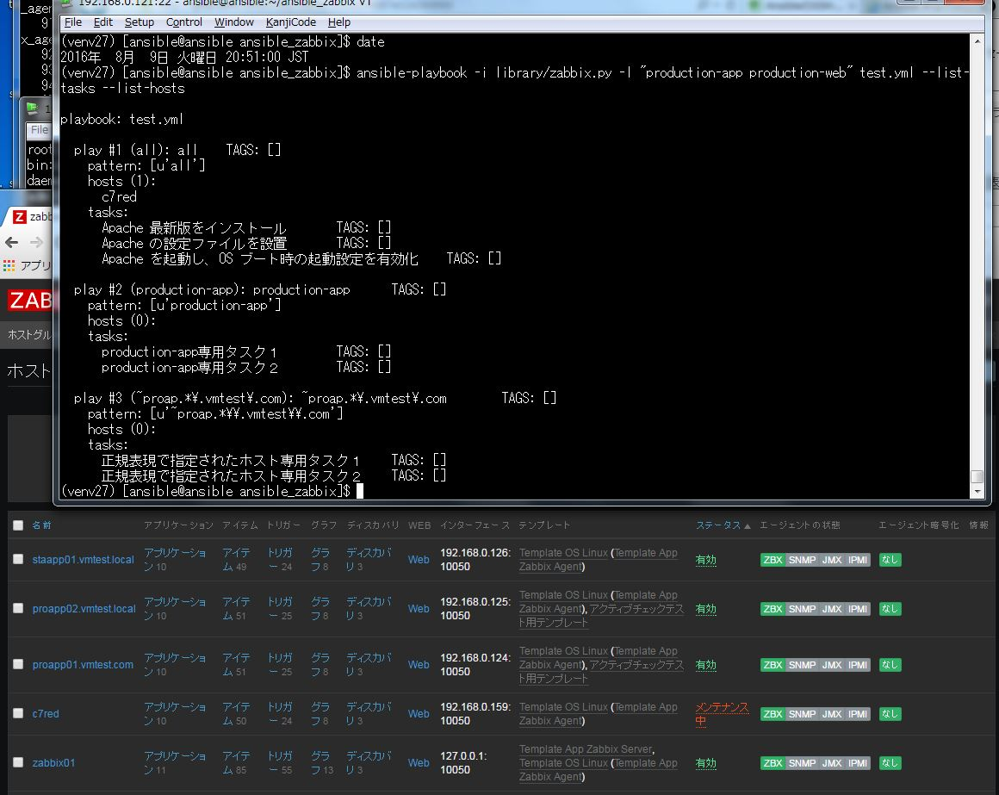
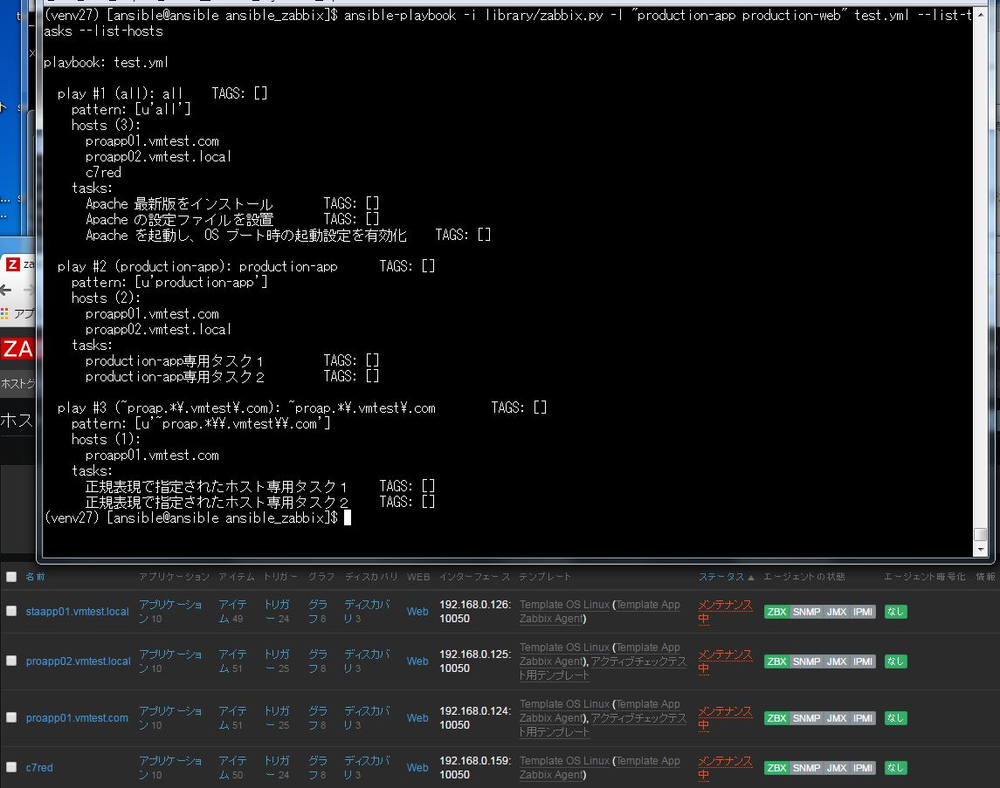

# Ansibleのダイナミックインベントリ機能を使ってZabbixと連携する

# フィルタなしの場合（全てのサーバが作業対象）
  

# メンテ期間中のサーバのみ実施（すべてが作業対象外）
  

# メンテ期間中のサーバのみ実施（c7redのみ作業対象）
  

# メンテ期間中のサーバのみ実施（すべてが作業対象）
  

上記のように実行前にどのサーバで何が実行されるかを事前に確認する  
